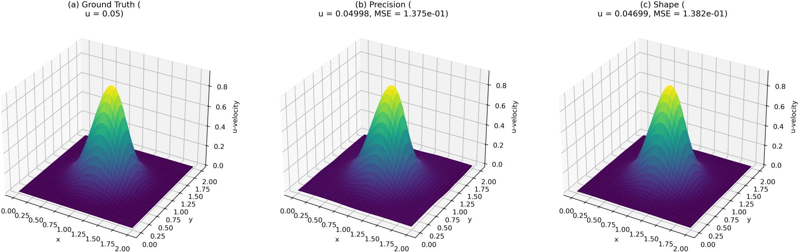

# Physics-Informed Neural Network for Parameter Discovery in the 2D Burgers' Equation

This repository contains the source code for the paper, "A Physics-Informed Neural Network for Solving the 2D Burgers' Equation," a detailed case study on the application of Physics-Informed Neural Networks (PINNs) to the inverse problem of discovering kinematic viscosity.

This work focuses on the practical implementation challenges and methodological refinements required to build a robust and accurate PINN-based solution. It serves as a practical guide, documenting the specific hurdles and actionable solutions that are crucial for the successful application of PINNs to inverse science problems.


*Comparison of the FDM reference solution (a) and representative PINN-predicted solutions for the u-velocity component from the "parameter" (b) and "shape" (c) experiments.*

---

## Key Contributions

-   **Robust Parameter Discovery:** Implementation of a PINN to successfully solve the inverse problem of discovering the kinematic viscosity parameter in the 2D Burgers' equation.
-   **Optimizer Stability Analysis:** A thorough investigation into the stability and performance of second-order optimizers, comparing a stable hybrid SciPy-based approach with a native TensorFlow Probability implementation.
-   **Data-Guided Training Strategy:** Successful application of a Data-Guided PINN (DG-PINN) training strategy, which involves pre-training the network on data alone to establish a strong baseline before introducing the physics-based loss.
-   **Automated Generalization:** Development of an automated initial guess search mechanism that significantly improves the model's ability to discover a wide range of parameter values without manual tuning.

## Repository Structure

-   **`src/`**: Contains all Python source code for the PINN models, plotting utilities, and ensemble run scripts.
    -   `main_precision.py`: The primary script for experiments focused on parameter discovery accuracy.
    -   `main_shape.py`: The primary script for experiments focused on visual data fidelity.
    -   `plot_main_figure.py`: Script to generate the main figure used in the manuscript.
-   **`results/`**: Contains output from the model runs, including `.npz` data files and generated figures.
-   **`latex/`**: Contains the LaTeX source files for the manuscript.
-   **`reviews/`**: Contains detailed, step-by-step research logs and reviews for each phase of the project.

## Getting Started

### Prerequisites

The model is implemented in Python using TensorFlow. A `requirements.txt` file is provided to ensure all necessary libraries are installed.

-   Python 3.x
-   TensorFlow 2.x (running in TF1 compatibility mode)
-   NumPy
-   SciPy
-   Matplotlib

### Installation

1.  Clone the repository:
    ```bash
    git clone https://github.com/your-username/burgers-pinn.git
    cd burgers-pinn
    ```

2.  Create and activate a virtual environment (recommended):
    ```bash
    python -m venv venv
    source venv/bin/activate
    ```

3.  Install the required packages:
    ```bash
    pip install -r requirements.txt
    ```

### Running the Model

You can run the primary experiments using the scripts in the `src/` directory. The `--seed` argument can be used for reproducibility.

1.  **Run a "precision" focused experiment:**
    ```bash
    python src/main_precision.py --seed 1
    ```

2.  **Run a "shape" focused experiment:**
    ```bash
    python src/main_shape.py --seed 1
    ```

The scripts will save their output (a `.npz` file containing the results) to the `results/` directory.

## Methodology Highlights

The core of this work is a PINN implemented with a four-layer fully connected network. The training process is divided into two key phases based on the Data-Guided PINN (DG-PINN) methodology:

1.  **Data-Only Pre-training:** The network is first trained for 10,000 epochs using only the data loss term ($\mathcal{L}_{data}$) with the Adam optimizer. This initializes the network to fit the observed data closely.
2.  **Composite Loss Fine-tuning:** The network is then fine-tuned on a composite loss function ($\mathcal{L} = \lambda_{data} \mathcal{L}_{data} + \lambda_{pde} \mathcal{L}_{pde}$), which includes both the data fidelity term and the PDE residual term. This phase uses the Adam optimizer for an initial 1,000-2,000 epochs, followed by the L-BFGS-B optimizer from SciPy, which runs until convergence to achieve high-precision results.

## How to Cite

If you find this work useful in your research, please consider citing our paper.

```bibtex
@article{Miranda2025PINNBurgers,
  title={A Physics-Informed Neural Network for Solving the 2D Burgers' Equation},
  author={Miranda, Eduardo Furlan and Souto, Roberto Pinto and Stephany, Stephan},
  journal={Proceedings of the XXVIII National Meeting on Computational Modeling (ENMC)},
  year={2025},
  note={To be published}
}
```

## License

This project is licensed under the Creative Commons Attribution-NonCommercial 4.0. See the `LICENSE` file for details.

## Notes

This repository was developed with the support of artificial intelligence (AI) tools to optimize processes, offer suggestions, and improve work efficiency. However, all information has undergone careful review, testing, and validation, ensuring accuracy and reliability. AI was used as a complementary resource to accelerate development, without replacing critical analysis, decision-making, and human authorship.

<br><sub>Last edited: 2025-08-27 08:10:29</sub>
