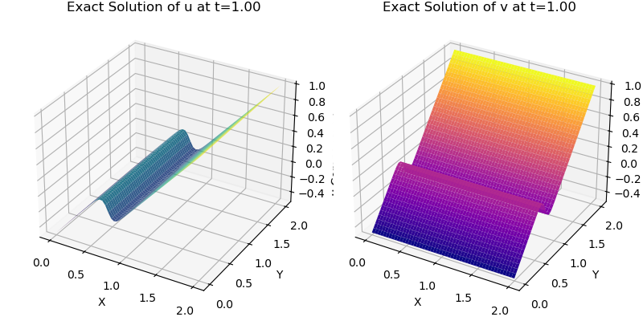
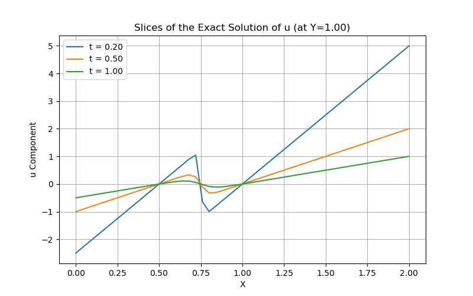

# Exact Solution for the 2D Viscous Burgers' Equation

This repository contains a Python script to calculate and visualize the exact analytical solution of the two-dimensional viscous Burgers' equation. The Burgers' equation is a fundamental model in fluid dynamics and applied mathematics, describing the interplay between nonlinear advection and viscous diffusion terms. The exact solution implemented here serves as a crucial benchmark for the validation and verification of numerical methods developed to solve this equation.

## Mathematical Formulation

The 2D viscous Burgers' equation is a system of partial differential equations for the velocity components `u(x, y, t)` and `v(x, y, t)`:

$$
\frac{\partial u}{\partial t} + u \frac{\partial u}{\partial x} + v \frac{\partial u}{\partial y} = \nu \left( \frac{\partial^2 u}{\partial x^2} + \frac{\partial^2 u}{\partial y^2} \right)
$$

$$
\frac{\partial v}{\partial t} + u \frac{\partial v}{\partial x} + v \frac{\partial v}{\partial y} = \nu \left( \frac{\partial^2 v}{\partial x^2} + \frac{\partial^2 v}{\partial y^2} \right)
$$

Where `ν` is the kinematic viscosity coefficient.

### Cole-Hopf Transformation

To obtain an analytical solution, we use the **Cole-Hopf transformation**. This ingenious transformation converts the nonlinear Burgers' equation into a linear heat equation, which is easier to solve. The transformation is defined through a potential function `φ(x, y, t)`:

$$
u \frac{1}{\phi} \frac{\partial \phi}{\partial x}
$$

$$
v(x, y, t) = -2\nu \frac{1}{\phi} \frac{\partial \phi}{\partial y}
$$

By substituting these relationships into the Burgers' equation, it is found that `φ` must satisfy the 2D heat equation:

$$
\frac{\partial \phi}{\partial t} = \nu \left( \frac{\partial^2 \phi}{\partial x^2} + \frac{\partial^2 \phi}{\partial y^2} \right)
$$

The `burgers2d-exact.py` script implements a solution for `φ` that is a superposition of four heat kernels (Gaussian solutions), corresponding to the evolution of four initial heat sources.

## The `burgers2d-exact.py` Script

### Overview

The script defines the functions for the potential solution `φ` and its partial derivatives. It then calculates the velocity fields `u` and `v` on a 2D mesh and generates two visualizations for analysis.

### Configurable Parameters

At the beginning of the script, the user can adjust the following parameters to match their own numerical simulation:

- `nx`, `ny`: Number of grid points in the x and y directions.
- `nu`: Viscosity coefficient.
- `times_for_slices`: A list of time instances (`t`) for which the solution profiles will be plotted.

### Execution

To run the script and generate the plots, use the following command in your terminal:

```bash
python burgers2d-exact_en.py
```

### Generated Outputs

The script execution produces two image files:

1. **`burgers_2d_solution.png`**: Contains two 3D surface plots showing the `u` and `v` velocity components across the entire domain at the final time specified in `times_for_slices`.
   
   

2. **`burgers_slices.png`**: Shows a 2D plot of profiles (slices) of the `u` velocity component along the x-axis (at a fixed `y` value). Each line in the plot represents a different time instance, allowing for the visualization of the wave's temporal evolution.
   
   

## Usage for Numerical Validation

The primary purpose of this code is to serve as a validation tool. To compare a numerical code against this exact solution:

1. Configure the parameters (`nx`, `ny`, `nu`) in the `burgers2d-exact_en.py` script to be identical to those in your simulation.
2. Adjust the `times_for_slices` list to include the time instances you wish to compare.
3. Run the script to generate the exact solution plots.
4. Plot the results from your numerical simulation at the same time instances and for the same `y`-slice for a direct comparison with `burgers_slices.png`.

## Dependencies

The script requires the following Python libraries:

- `numpy`
- `matplotlib`

<br><sub>Last edited: 2025-10-27 14:07:52</sub>
