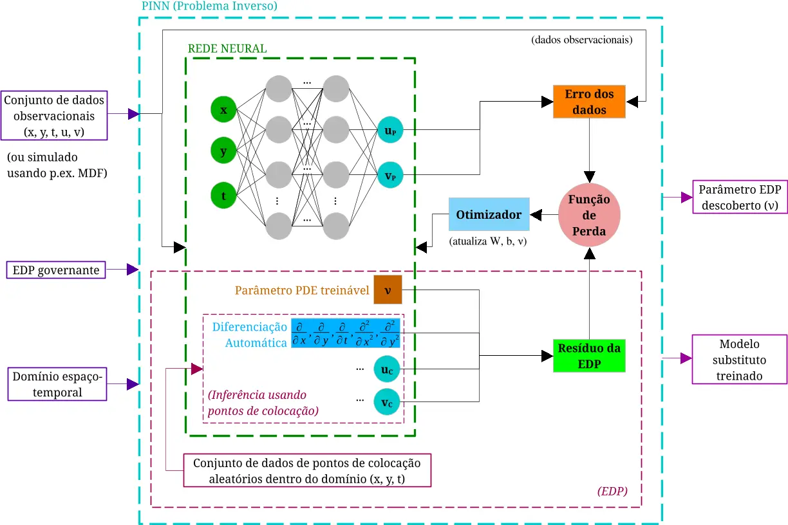
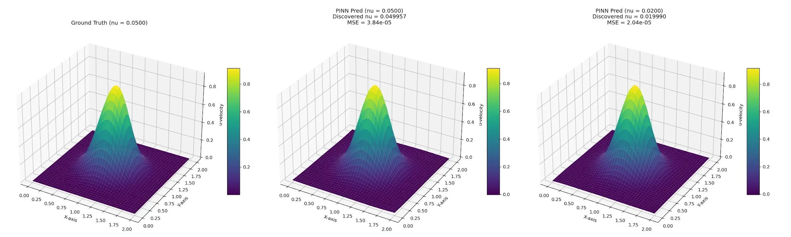

# Parameter Discovery in the 2D Burgers' Equation via Physics-Informed Neural Networks

**Eduardo Furlan Miranda**$^{1}$, **Roberto Pinto Souto**$^{2}$, **Stephan Stephany**$^{1}$  
*$^1$National Institute for Space Research (INPE), São José dos Campos - SP*  
*$^2$National Laboratory for Scientific Computing (LNCC), Petrópolis - RJ*

## Abstract

A Physics-Informed Neural Network (PINN) is proposed for the discovery of the kinematic viscosity parameter ($\nu$) in the 2D Burgers' equation. The methodology employs a hybrid optimization strategy, combining the Adam optimizer with L-BFGS-B, and incorporates advanced techniques such as adaptive loss weighting, curriculum learning for the parameter $\nu$, and range-based regularization to enhance convergence and stability. The results demonstrate the model's high precision in the inverse problem, achieving the discovery of $\nu$ with consistently low relative errors, ranging from 0.0% to 1.7% across multiple test scenarios. The study also reveals the model's robustness to the addition of Gaussian noise in the training data. Although the parameter discovery is accurate, the generalization of the parametric model to a wider range of $\nu$ values remains a challenge. This work emphasizes the effectiveness of specific training strategies for the application of PINNs in inverse problems in science and engineering.

**Keywords:** Physics-Informed Neural Networks, Burgers’ Equation, Parameter Discovery, Inverse Problems, Finite Difference Method.

## 1. Introduction

Partial differential equations (PDEs) are fundamental to many scientific and engineering disciplines, classically resolved by numerical methods such as the Finite Element Method (FEM) [Zienkiewicz et al., 2013] and the Finite Difference Method (FDM) [LeVeque, 2007], which form the basis of these methods. Burgers' equation [Burgers, 1948] is a nonlinear PDE of particular interest, as it appears in various fields such as fluid mechanics, nonlinear acoustics, and traffic flow. The so-called "direct problem" solves the PDE using known parameters utilizing one of the well-known methods, whereas the "inverse problem" estimates PDE parameters from observed or synthetic data, representing an open challenge due to its frequently ill-posed nature and sensitivity to noise or limitations in input data. In this context, PINNs emerge as a computationally attractive machine learning approach, primarily because they do not depend on high-resolution discretization meshes, one of the main cost factors in large-scale simulations used in both direct and inverse problems.

This work explores the inverse problem of the 2D Burgers' equation for estimating the kinematic viscosity parameter via a PINN [Raissi et al., 2019], detailing refinements applied to the training of this neural network. Practical implementation challenges are addressed, and methodological improvements are presented for a robust and accurate determination of kinematic viscosity. Key improvements include the implementation of Weighted Curriculum Learning, the integration of callbacks, and Range-Based Regularization. Furthermore, we highlight the implemented hybrid optimization approach, which combines the Adam algorithm [Kingma and Ba, 2014] for a global search, and L-BFGS-B [Zhu et al., 1997] for a local search. The source code for this work is publicly available at [https://github.com/efurlanm/burgers-pinn](https://github.com/efurlanm/burgers-pinn).

## 2. Related Work

The use of machine learning, specifically deep learning, to solve differential equations has shown growing interest, with Physics-Informed Neural Networks (PINNs) emerging as a highlight. A pioneering study by Raissi, Perdikaris, and Karniadakis (2019) presented the fundamental framework for PINNs, demonstrating their effectiveness in solving direct and inverse problems involving nonlinear PDEs. Subsequent studies and reviews, such as Cuomo et al. (2022), provided a comprehensive overview of the field, consolidating the importance of PINNs in machine learning applied to scientific problems.

PINNs have been successfully applied to some fluid dynamics problems, including the Burgers and Navier-Stokes equations (Raissi, Perdikaris, and Karniadakis, 2019). Although these applications demonstrate the potential of PINNs, solving inverse problems, such as parameter discovery, remains a significant challenge. The literature in the field frequently notes that identifying unknown physical parameters is significantly more difficult than solving the direct problem, often due to the use of limited or noisy observational data.

Many studies have focused on the challenges associated with the training of PINNs, which involves the minimization of a loss function whose gradients may assume near-zero or excessively high values. Furthermore, the proposed PINN utilizes a composite loss function that can lead to an imbalanced optimization problem, where one of its terms may dominate the gradients, hindering convergence; this can be circumvented by using an adaptive weighting scheme that dynamically adjusts the weights of the loss terms during training. The choice of optimizer is also a critical factor, with many studies employing a hybrid approach, such as the one proposed in the implemented PINN: an initial global search using a standard neural network, in this case with the Adam optimizer (Kingma and Ba, 2014), followed by a local search employing a quasi-Newton method, in this case, the L-BFGS-B method (Wang, Teng, and Perdikaris, 2021).

This work adopts a two-stage optimization strategy, separating the training of the parametric network from the subsequent parameter discovery. In Stage 1, a standard neural network is employed with the Adam optimizer utilizing a standard *data loss* calculated from the difference between the observed data and the data estimated by the network. In Stage 2, related to the discovery of the parameter $\nu$, the network pre-trained in the previous stage is retrained with a composite loss function, which considers the previous *dataloss* term and a second *PDEloss* term relative to the residuals of the application of the PDE to a set of collocation points. However, Stage 2 utilizes a hybrid approach, where its training begins using the Adam optimizer for a global search and then proceeds with the L-BFGS-B optimizer for a local search.

Despite the literature's focus on new architectures, there is a scarcity of studies detailing practical implementation difficulties, such as execution instabilities of optimizers or interactions with JIT compilers, which are critical for reproducibility. This work aims to fill this gap, offering insights into the choice of optimizers and the configuration of the software environment to obtain reliable results.

## 3. The 2D Burgers' Equation

The 2D Burgers' equation is a system of two coupled, nonlinear partial differential equations (PDEs) that describe the velocity field of a fluid. The equations are given by:
$$
\frac{\partial u}{\partial t} + u \frac{\partial u}{\partial x} + v \frac{\partial u}{\partial y} = \nu \left( \frac{\partial^2 u}{\partial x^2} + \frac{\partial^2 u}{\partial y^2} \right) \quad
$$
and
$$
\quad \frac{\partial v}{\partial t} + u \frac{\partial v}{\partial x} + v \frac{\partial v}{\partial y} = \nu \left( \frac{\partial^2 v}{\partial x^2} + \frac{\partial^2 v}{\partial y^2} \right) \quad (1)
$$
Above, $u(x, y, t)$ and $v(x, y, t)$ are the velocity components in the $x$ and $y$ directions, respectively, and $\nu$ represents the kinematic viscosity of the fluid. For this study, a benchmark configuration was defined with a spatial domain $\Omega = \times$ and a temporal domain $T = [0, 0.05]$. The discretization for the generation of reference data utilizes a grid of $41 \times 41$ spatial points and 50 time steps. This configuration was chosen for being sufficiently refined to capture the nonlinear dynamics of Burgers' equation, while remaining computationally tractable, serving as a clear and reproducible validation problem for the proposed method.

At any instant $t$, the complete set of velocity components $u$ and $v$ for the spatial domain is denoted as the velocity field. The initial condition for the velocity components at $t = 0$ is given below by a Gaussian pulse of amplitude 1.0 centered at $(1, 1)$, chosen for being a well-known non-trivial solution of Burgers' equation and, therefore, easily evaluated.
$$
u(x, y, 0) = v(x, y, 0) = \exp \left( - \frac{(x - 1)^2}{0.125} - \frac{(y - 1)^2}{0.125} \right) \quad (2)
$$
Compared to the one-dimensional implementation of Burgers' equation, the implementation of its two-dimensional version presents significant challenges. In terms of conceptual complexity, the problem shifts from a single Partial Differential Equation (PDE) to a system of two coupled PDEs. The velocity field is now expressed as a two-dimensional vector, and the interactions between its components $u$ and $v$ (e.g., $v \cdot [\partial u/\partial y]$ and $u \cdot [\partial v/\partial x]$) must be accurately modeled. Another challenge is the dimensionality of the neural network. The input domain of the neural network increases from $(x, t)$ to $(x, y, t)$, requiring a much larger number of collocation points to effectively apply the PDE residual throughout the spatiotemporal domain. Finally, in the 2D case, the implementation complexity also increases, since the neural network needs two outputs ($u$ and $v$) instead of one, and the calculation of PDE residuals becomes more complex due to the higher number of partial derivatives, including cross-partial derivatives.

Collocation points are specific points within the spatiotemporal domain where the neural network is constrained to satisfy the governing PDE, typically used to compute the PDE residual term in the loss function. These points are generated using random sampling within the domain. In the methodology presented here, the kinematic viscosity ($\nu$) for these points is dynamically sampled from a curriculum range during training, as detailed in Section 4.3. Achieving convergence of the loss function does not inherently guarantee an accurate estimation of $\nu$, as the optimizer may converge to a local minimum in the parameter search space.

## 4. Methodology and PINN Model

This section details the PINN model architecture, which constitutes Stage 2 of the proposed methodology and utilizes the standard neural network from Stage 1, which was trained with observational velocity data using the Adam optimizer.

### 4.1. Model Architecture

As mentioned, in Stage 2, the PINN model employs a hybrid approach in training, composed of iterations with the Adam optimizer followed by iterations with the L-BFGS-B optimizer. The PINN neural network has an input layer with 4 neurons ($x, y, t, \nu$), followed by 5 hidden layers, each containing 60 neurons, and an output layer with 2 neurons ($u, v$), totaling 7 layers. The input and output layers do not use an activation function, while the hidden layers use the Swish activation function (Ramachandran, Zoph and Le, 2017), chosen for two reasons. The first reason is its smooth and continuously differentiable nature, which is advantageous for the calculation of high-order derivatives required by the PDE residual, in contrast to functions with discontinuous gradient such as the ReLU function. The second reason is its better performance in nonlinear problems and its ability to avoid the "dead neuron" (*dying ReLU*) problem, common in deep networks. The Glorot method (Glorot and Bengio, 2010) was used for the initialization of the network weights and biases, improving training stability. Another refinement is the employment of L2 regularization, which adds a penalty term to the loss function, proportional to the square of the hidden layer weights, to avoid overfitting. All inputs ($x, y, t, \nu$) are normalized to the interval $[-1, 1]$.

A schematic view of this architecture is presented in Figure 1. The neural network receives as input the set of spatiotemporal coordinates ($x, y, t$), inferring the velocity components ($u, v$), in addition to a candidate value for the kinematic viscosity ($\nu$). The loss function expresses the error corresponding to the difference between the input velocities and those inferred by the network (*dataloss* term) and the error corresponding to the PDE residual (*PDEloss* term).

This architecture was defined based on common practices in PINN literature and empirically adjusted for the problem in question. An exhaustive sensitivity analysis of hyperparameters is outside the scope of this work.

**Figure 1.** Schematic view of the PINN architecture proposed for Stage 2.

### 4.2. Synthetic Data Generation

In place of observed data, synthetic velocity field data generated by a Finite Difference Method (FDM) implementation is used for the 2D Burgers' equation. The adopted 2D grid has $41 \times 41$ points covering a spatial domain $[0, 2]$ in both dimensions, while the temporal domain spans 50 time steps $t$ with intervals of 0.001. The initial conditions for the velocity components $u$ and $v$ at $t=0$ are given by a Gaussian pulse of amplitude 1.00 centered at the point $(1.0, 1.0)$ with standard deviations of 0.25 in both dimensions. Synthetic velocity data were generated for the following time instants: $nt/4$, $nt/2$, $3nt/4$, and $nt$. Test cases were executed for true kinematic viscosity of 0.05 or 0.02, and a third test case with Gaussian noise for this latter viscosity.

### 4.3. Training Strategy

The model training process is divided into two main stages. Stage 1 is dedicated to the training of the parametric PINN, so that the network adjusts its weights and biases to infer velocities, thus making the resolution of Burgers' equation unnecessary. Stage 2 resolves the inverse problem, i.e., it performs the discovery of the true viscosity from the same observational data regarding velocities, but also from the inference of velocities for a set of collocation points. This multifaceted approach was adopted to overcome known optimization challenges in PINNs, such as gradient balancing and convergence to inadequate local minima, which frequently arise in inverse problems (Wang, Teng and Perdikaris, 2021).

Stage 1 constitutes a pre-training of 500 epochs, utilizing the Adam optimizer, where the network is adjusted exclusively based on the loss function calculated from the difference between observed and estimated data. This initializes the network weights and biases in a promising region of the space of these network parameters. Stage 2 follows, utilizing the neural network pre-trained in Stage 1, but estimating the viscosity parameter and utilizing a loss function that characterizes it as a PINN. In this stage, 1,000 epochs with the Adam optimizer succeed, followed by another 5,000 with the L-BFGS-B optimizer. In both, a composite loss function is utilized, constituted by the data error term (*dataloss*) and by the PDE residual term (*PDEloss*). The first term is equal to the loss function of Stage 1, while the second term is calculated for the 10,000 collocation points for which the neural network itself infers velocities, with the PDE residual being calculated for these velocities and their derivatives considering the candidate viscosity being estimated by the PINN.

The SciPy L-BFGS-B optimizer (Virtanen et al., 2020) is a quasi-Newton method that performs an in-depth local search to find the value of $\nu$ that minimizes the loss function. The choice of the "B" variant (*bound-constrained*) is deliberate, as it allows the imposition of box constraints, i.e., lower and upper bounds for the parameters. Although the code utilizes range-based regularization, the optimizer's ability to inherently handle such constraints is fundamental for physical parameter discovery problems, ensuring that the solution remains in a plausible domain (e.g., $\nu > 0$). To stabilize training, several techniques are applied. A *curriculum learning* scheme (Bengio et al., 2009) is adopted for the parameter $\nu$, where the range of viscosity values sampled for the collocation points increases gradually over the epochs. Specifically, a linear schedule is utilized, in which the upper limit of the sampling range expands from an initial value to the defined maximum, varying linearly with the training epochs. Additionally, an adaptive weighting, based on an *annealing* algorithm, dynamically adjusts the influence of each term of the loss function (Wang, Teng and Perdikaris, 2021). An extra weighting, dependent on $\nu$, is applied to the PDE residuals to prioritize accuracy in low-viscosity regimes. The learning rate of the Adam optimizer is managed dynamically by a reduction on *plateau* mechanism (*learning rate scheduling*), which decreases the optimizer step if the loss function suffers stagnation, allowing for finer adjustment in promising regions of the search space.

## 5. Methodological Refinements and Challenges

Achieving an accurate and robust solution required several methodological refinements. This section details the training strategy, the challenges encountered with optimizers and model generalization, and how they were overcome.

This study required a low-level implementation to investigate the stability of the L-BFGS-B optimizer and its interaction with just-in-time (JIT) compilation. This fine-grained control is often obscured by abstractions in high-level PINN libraries, leading to the implementation of new neural networks in TensorFlow in this study (Abadi et al., 2015). This framework was chosen for its mature automatic differentiation engine, essential for the calculation of derivatives in the PINN loss function. Furthermore, previous experience with TensorFlow simplified development, allowing a focus on the training dynamics rather than on implementation details. This straightforward approach was crucial for revealing practical insights that, otherwise, would be hidden by specialized libraries.

The main implementation challenge was achieving stable convergence during training using the L-BFGS-B optimizer, which led to the investigation of two different library implementations for this specific optimizer. The first implementation is a hybrid approach using TensorFlow with the SciPy optimizer, which proved robust after resolving an instability in its linear search, even introducing a significant performance bottleneck in data transfer from CPU to GPU. In contrast, the second implementation, a native TensorFlow Probability (TFP) optimizer, although theoretically having better computational performance, failed to converge due to a subtle interaction with the JIT compiler (@tf.function). Disabling the JIT decorator stabilized the TFP optimizer but severely degraded its performance. This investigation reveals a critical trade-off between robustness and speed in current second-order optimizers, leading to the selection of the first implementation, the hybrid TensorFlow/SciPy.

## 6. Results and Discussion

To evaluate the robustness and precision of the proposed model, a systematic experimental study was conducted. The PINN's capability to solve the inverse problem was tested under different conditions, varying the true kinematic viscosity ($\nu_{true}$), the initial value for curriculum learning ($\nu_{initial}$), and the randomness seed to ensure reproducibility. Additionally, the impact of adding Gaussian noise to the training data on the precision of parameter discovery was investigated.

### 6.1. Precision and Robustness in Parameter Discovery

The results of the viscosity parameter discovery, summarized in Table 1, demonstrate the high precision of the method. In multiple trials with different randomness seeds and initial values, the relative error between the discovered $\nu$ value and the true value remained consistently low, generally below 1%. For example, for a true value $\nu_{true} = 0.05$. This value, with six decimal places of precision, corresponds to an effective relative error of 0.0%, demonstrating the high accuracy of the method with $\nu_{initial} = 0.09$ and seed 53. The low Mean Squared Error (MSE) of prediction for the Stage 2 model (on the order of $10^{-5}$ to $10^{-6}$) corroborates the precision of the found solution. The total execution time for each trial was approximately 500 seconds on a single GPU, indicating the computational viability of the approach.

From the computational cost point of view, Table 1 shows that the total execution time is consistent, with an average of approximately 500 seconds per trial. Detailed analysis of the execution reveals that the majority of this time (more than 90%) is consumed during the training of the parametric network in Stage 1, which utilizes the Adam optimizer. Stage 2, although numerically sensitive, is computationally faster due to the smaller number of epochs and the fact that it optimizes a single parameter. This performance profile suggests that future optimizations should focus on accelerating the training of the main network.

**Table 1.** Results of $\nu$ discovery for different configurations.

| $\nu_{true}$ | $\nu_{initial}$ | Seed | $\nu_{discovered}$ | Total Prediction MSE ($u+v$) | Relative Error (%) | Time (s) |
|:------------ |:--------------- |:---- |:------------------ |:---------------------------- |:------------------ |:-------- |
| 0.02         | 0.2             | 17   | 0.019949           | 2.03E-05                     | 0.255              | 496.81   |
| 0.02         | 0.2             | 53   | 0.019868           | 5.62E-05                     | 0.66               | 496.93   |
| 0.02         | 0.2             | 89   | 0.020337           | 1.46E-05                     | 1.685              | 495.95   |
| 0.02         | 0.09            | 17   | 0.020169           | 2.90E-05                     | 0.845              | 499.67   |
| 0.02         | 0.09            | 53   | 0.01999            | 2.04E-05                     | 0.05               | 506.97   |
| 0.02         | 0.09            | 89   | 0.020023           | 2.38E-05                     | 0.115              | 500.63   |
| 0.05         | 0.2             | 17   | 0.050223           | 1.03E-05                     | 0.446              | 501.36   |
| 0.05         | 0.2             | 53   | 0.050163           | 6.08E-06                     | 0.326              | 512.1    |
| 0.05         | 0.2             | 89   | 0.050562           | 1.31E-05                     | 1.124              | 507.8    |
| 0.05         | 0.09            | 17   | 0.050018           | 1.50E-05                     | 0.036              | 521.27   |
| 0.05         | 0.09            | 53   | 0.05               | 1.37E-05                     | 0                  | 516.84   |
| 0.05         | 0.09            | 89   | 0.049917           | 1.06E-04                     | 0.166              | 524.42   |

### 6.2. Impact of Data Noise

To evaluate the robustness of the model in more realistic scenarios, where observational data may contain inaccuracies, an experiment was conducted by adding different levels of Gaussian noise to the training data. The results indicate a non-trivial relationship between noise and error. Although the error increases when introducing 1% noise, it surprisingly decreases for higher noise levels (5% and 10%), as seen in Table 2. Even in these scenarios, the PINN is still able to discover a value of $\nu$ close to the true one, demonstrating the effectiveness of the regularization imposed by the physics of the PDE to mitigate the impact of imperfect data.

**Table 2.** Results of $\nu$ discovery ($\nu_{true} = 0.02$) with different noise levels.

| Noise Level | $\nu_{discovered}$ | Total Prediction MSE ($u+v$) | Relative Error (%) |
|:----------- |:------------------ |:---------------------------- |:------------------ |
| 0.0%        | 0.019170           | 5.46e-05                     | 4.15               |
| 1.0%        | 0.022487           | 9.78e-06                     | 12.43              |
| 5.0%        | 0.019700           | 3.24e-05                     | 1.50               |
| 10.0%       | 0.019934           | 2.39e-05                     | 0.33               |

### 6.3. Qualitative Analysis

In addition to the quantitative analysis, the quality of the solution learned by the PINN was evaluated visually,. Figure 2 compares the velocity field predicted by the PINN in Stage 2 with the reference solution generated by the Finite Difference Method (FDM),. The comparison shows excellent qualitative agreement between the PINN solution and the numerical reference solution, correctly capturing the shape and dynamics of the flow,. This confirms that the neural network not only discovers the correct physical parameter, but also learns a faithful representation of the PDE solution throughout the spatiotemporal domain,.

**Figure 2.** Visual comparison between the FDM reference solution (left) and the solution predicted by the PINN (right) for the final velocity field ($t=0.05$) with $\nu=0.05$ and with $\nu=0.02$. The similarity between the solutions demonstrates the PINN's capability to learn the fluid dynamics with fidelity.

## 7. Conclusion

The present work demonstrated the successful implementation of a robust PINN for the discovery of kinematic viscosity in the 2D Burgers' equation. The methodology, which combines a hybrid optimization approach, adaptive loss function weighting, and curriculum learning, proved to be effective, resulting in estimates of $\nu$ with high precision and low relative error in various scenarios, including noisy data. The quantitative and qualitative results confirm that the PINN not only solves the inverse problem accurately but also learns a faithful representation of the PDE solution,. Although Stage 2 demonstrated excellent performance, the generalization capability of the parametric model (Stage 1) over a wider range of $\nu$ values remains a point for future investigation.

## 8. Future Work

Future work will focus on three main axes of high-performance computing. First, the scalability of the model will be investigated for higher-dimensional problems, such as the 3D Burgers' equation or domains with more complex geometries, evaluating the growth of computational cost and memory demand,. Second, to overcome the identified CPU-GPU communication bottleneck, the implementation of native GPU second-order optimizers, which have become more stable in recent versions of deep learning libraries, will be explored. Third, distributed training strategies will be applied, utilizing multiple GPUs (*multi-GPU*) and multiple nodes (*multi-node*) with *tf.distribute.Strategy*, to reduce the training time of the parametric network, allowing the approach of inverse problems at larger scales.

### Acknowledgments

The authors thank the *oordination for the Improvement of Higher Education Personnel, Brazil (CAPES) and the LNCC (National Laboratory for Scientific Computing) for access to the Santos Dumont supercomputer through the AMPEMI project. The authors also thank the Ministry of Science, Technology and Innovation and the Brazilian Space Agency.

## References

* Abadi, M. *et al.* (2015) “TensorFlow: Large-scale machine learning on heterogeneous distributed systems”, *arXiv preprint arXiv:1603.04467* [Preprint].
* Bengio, Y. *et al.* (2009) “Curriculum learning”, **in** *Proceedings of the 26th Annual International Conference on Machine Learning*. *ICML ’09: The 26th Annual International Conference on Machine Learning held in conjunction with the 2007 International Conference on Inductive Logic Programming*, Montreal Quebec Canada: ACM, p. 41–48. **Available at:** https://doi.org/10.1145/1553374.1553380.
* Burgers, J.M. (1948) “A mathematical model illustrating the theory of turbulence”, *Advances in applied mechanics*, 1, p. 171–199. **Available at:** https://www.sciencedirect.com/science/article/pii/S0065215608701005 (**Accessed on:** October 3, 2025).
* Cuomo, S. *et al.* (2022) “Scientific Machine Learning Through Physics–Informed Neural Networks: Where we are and What’s Next”, *Journal of Scientific Computing*, 92(3), p. 88. **Available at:** https://doi.org/10.1007/s10915-022-01939-z.
* Glorot, X. **and** Bengio, Y. (2010) “Understanding the difficulty of training deep feedforward neural networks”, **in** *Proceedings of the thirteenth international conference on artificial intelligence and statistics*. JMLR Workshop and Conference Proceedings, p. 249–256. **Available at:** http://proceedings.mlr.press/v9/glorot10a (**Accessed on:** October 3, 2025).
* Kingma, D.P. **and** Ba, J. (2014) “Adam: A method for stochastic optimization”, *arXiv preprint arXiv:1412.6980* [Preprint].
* LeVeque, R.J. (2007) *Finite difference methods for ordinary and partial differential equations: Steady-state and time-dependent problems*. SIAM.
* Raissi, M., Perdikaris, P. **and** Karniadakis, G.E. (2019) “Physics-informed neural networks: A deep learning framework for solving forward and inverse problems involving nonlinear partial differential equations”, *Journal of Computational Physics*, 378, p. 686–707. **Available at:** https://doi.org/10.1016/j.jcp.2018.10.045.
* Ramachandran, P., Zoph, B. **and** Le, Q.V. (2017) “Searching for Activation Functions”. arXiv. **Available at:** https://doi.org/10.48550/arXiv.1710.05941.
* Virtanen, P. *et al.* (2020) “SciPy 1.0: fundamental algorithms for scientific computing in Python”, *Nature methods*, 17(3), p. 261–272.
* Wang, S., Teng, Y. **and** Perdikaris, P. (2021) “Understanding and mitigating gradient flow pathologies in physics-informed neural networks”, *SIAM Journal on Scientific Computing*, 43(5), p. A3055–A3081.
* Zhu, C. *et al.* (1997) “Algorithm 778: L-BFGS-B: Fortran subroutines for large-scale bound-constrained optimization”, *ACM Trans. Math. Softw.*, 23(4), p. 550–560. **Available at:** https://doi.org/10.1145/279232.279236.
* Zienkiewicz, O.C., Taylor, R.L. **and** Zhu, J.Z. (2013) *The finite element method: Its basis and fundamentals*. Butterworth-Heinemann.
